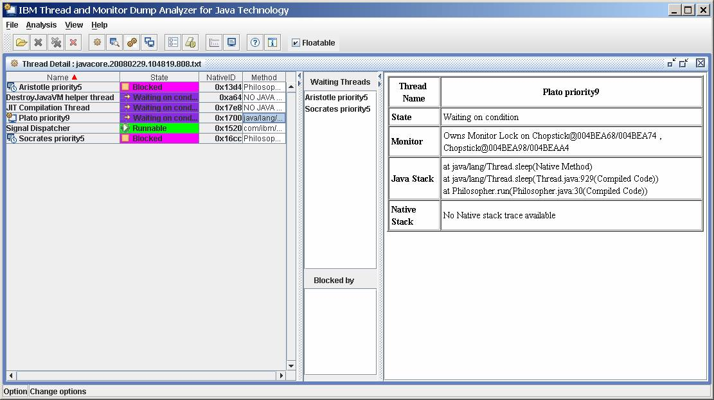

-----------

테스트 [재료::면], [재료::분말], [재료::스프]
```dataview
TABLE 재료
where file.name = this.file.name
```


```dataview
TABLE 재료, 재료1
where file.name = this.file.name
```


# 제<span style='color:#eb3b5a'>목</span>1
## <span style='color:#8854d0'>제목2</span>

### 제목3
#### 제목4
제목
====== 


+ 1단계
	+ 2[단계](https://wts.mocomsys.com)
		+ **안녕하세요**
		+ 
> test 
> test
> tttt
> 	> asdtest
              test
              
  * 1. 1111
  2. 2222
  3. 3333
1. test
	1. test
	2. tste
!![[Note Name]]
1. test
2. test
	1. tset
	2. test
	3. 


This is a normal paragraph:

   `` This is a code block.
    
end code block.
[[]]
[[markdown-cheat-sheet]]
[[Note Name]]
test asdf
	``testt

test
   t
`` ttttest


😄

```java
public class BootSpringBootApplication {
  public static void main(String[] args) {
    System.out.println("Hello, Honeymon");
  }
}
```
***

사용문법: [Go google](Google)
적용예: [Google](https://google.com)
[[read me]]

MIN_Obsidian/image/001.jpg
* test
* **test 


MIN_Obsidian/image/001.jpg


</img><br/>


</img>


* 줄 바꿈을 하기 위해서는 문장 마지막에서 3칸이상을 띄어쓰기해야 한다___   이렇게

 테스트
	테스트
	스트
	테테

___이게 아님___
``` test ```
`` test

+ dlalswl     
  test
  test
  test
  [naver](https://www.naver.com)[[test 1]]
  
- [ ] 할일 [[markdown-cheat-sheet]]
- [ ] 할일
- [t] 할일
## 보여라


https://github.com/min2zeus/obsidian/blob/77dc9ccb7b03a6092f68e575c1e87117334096a6/MIN_Obsidian/image/001.png




| Header | value | Description |
| --: | :-- | :--: |
| 정렬 | --: | 우측정렬 |
| 정렬 | :-- | 좌측정렬 |
| 정렬 | :--: | 가운데정렬 |


# 🙏 Trello Clone Coding

**Assistant**
 - Trello Clone with React + Redux

**Feachur**

|Feachure|Description||
|:--:|:--:|
|Author|StudyTeam|
|Node|14.17.3|
|yarn|1.22.5|
|referrence|[goddaehee.tistory.com](http://goddaehee.tistory.com/)
|referrence|[샘플.com](http://샘플.com/)


**Style**
 - [material-ui] (https://mui.com/getting-started/usage/)


옵시디언 장점


```dataview
TABLE wakeup as "기상", sleep as "취침", workout as "운동", gratitude as "감사", pills as "건강 약", reading as "독서" FROM "Planner/2021/01 Daily" WHERE date(today) - file.ctime <= dur(30 days) SORT file.name desc
```
[key1::value1]

---
재료 : 분말
재료 : 면
재료 : 스프

---

테스트 [재료::면], [재료::분말], [재료::스프]


---

```dataview
TABLE time-played, length, rating FROM "games" SORT rating desc
```

